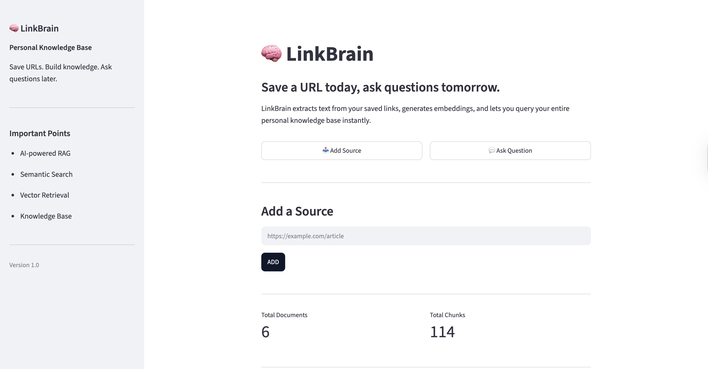
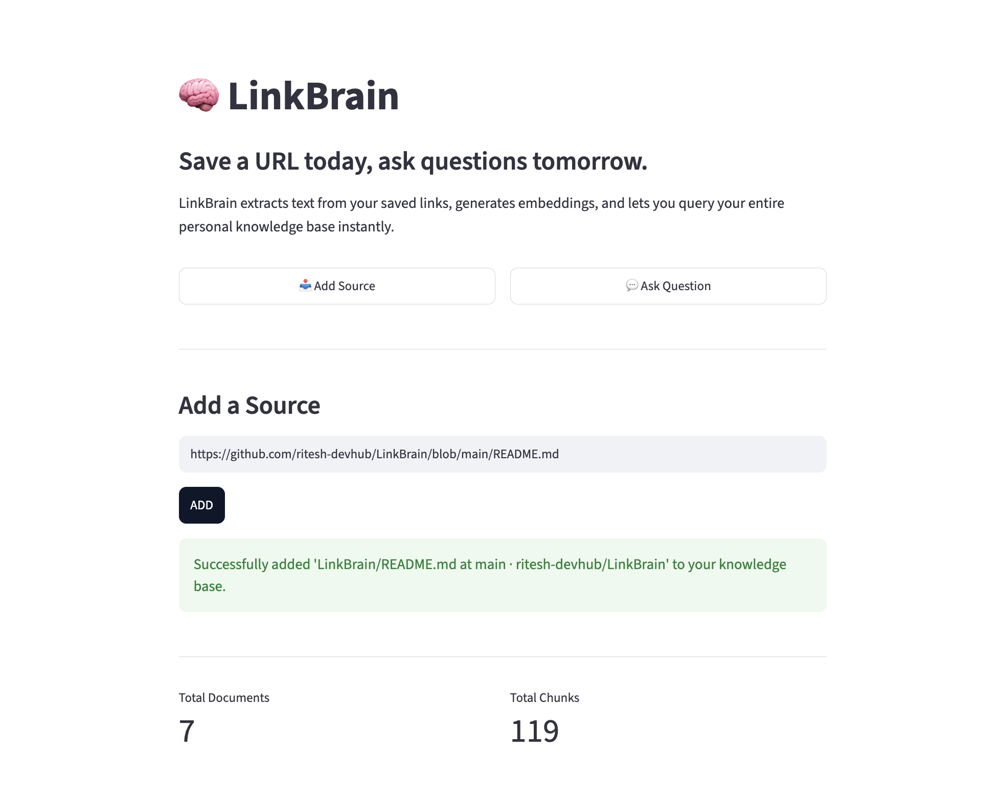
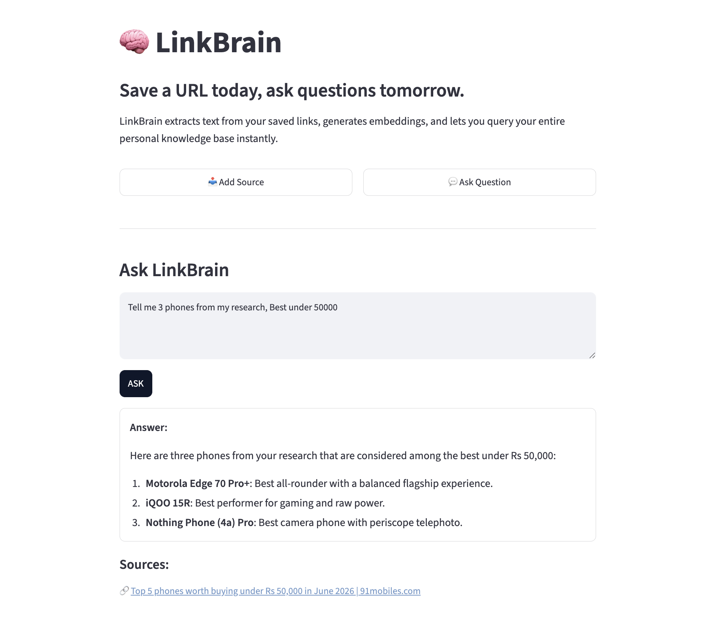

<div align="center">

# 🧠 LinkBrain

### Save a URL today. Ask questions tomorrow.

An AI-powered personal knowledge base that transforms saved web content into a searchable RAG system using embeddings, vector search, and LLMs.


</div>

---

## 🚀 The Problem

We save articles, blogs, PDFs, and resources every day, but finding useful information later is difficult. Traditional bookmarks become cluttered, and keyword search often fails when you don't remember the exact wording.

## 💡 The Solution

LinkBrain converts saved web content into a personal AI knowledge base. Instead of manually searching through bookmarks, users can ask questions in natural language and receive grounded answers generated from their own saved content.

---

## 📸 Demo

### Homepage

<p align="center">
  
</p>

### Core Workflow

<p align="center">
  
  
</p>

<p align="center">
  <em>Left: URL Ingestion &nbsp;&nbsp;&nbsp;|&nbsp;&nbsp;&nbsp; Right: AI-Powered Question Answering</em>
</p>


## ✨ Features

- 🔗 Save content directly from URLs
- 📄 Supports HTML, PDF, JSON, and plain text sources
- ✂️ Semantic chunking for efficient retrieval
- 🧠 Embedding generation using Sentence Transformers
- 🔍 Semantic search powered by ChromaDB
- 🤖 Context-aware answers using Gemini 2.5 Flash
- 🛡️ Duplicate content detection using SHA-256 hashing
- 📚 Source-backed responses with citations

---

## ⚙️ How It Works

```text
URL
 ↓
Content Extraction
 ↓
Markdown Conversion
 ↓
Semantic Chunking
 ↓
Embedding Generation
 ↓
ChromaDB + SQLite Storage
 ↓
User Question
 ↓
Vector Search
 ↓
Gemini Response Generation
```

---

## 🏗️ Architecture

### Ingestion Pipeline

1. Fetch content from URL
2. Detect content type
3. Extract and clean content
4. Split into semantic chunks
5. Generate embeddings
6. Store metadata and vectors

### Retrieval Pipeline

1. Convert query into embeddings
2. Retrieve relevant chunks
3. Build context window
4. Generate grounded response using Gemini
5. Return answer with sources

---

## 🛠️ Tech Stack

| Category | Technology |
|-----------|------------|
| Frontend | Streamlit |
| LLM | Gemini 2.5 Flash |
| Embeddings | all-MiniLM-L6-v2 |
| Vector Database | ChromaDB |
| Metadata Storage | SQLite |
| Content Extraction | Trafilatura, PyMuPDF |
| Frameworks | LangChain |
| Language | Python |

---

## 📂 Project Structure

```text
LinkBrain/
│
├── app.py
├── ingestion/
│   ├── extractor.py
│   ├── chunker.py
│   └── embedder.py
│
├── retrieval/
│   ├── retrieval.py
│   └── ask_llm.py
│
├── database/
│   ├── chroma_db.py
│   └── sqlite_storage.py
│
├── pipelines/
└── utils/
```

---

## 🚀 Getting Started

### Clone Repository

```bash
git clone https://github.com/yourusername/LinkBrain.git
cd LinkBrain
```

### Install Dependencies

```bash
pip install -r requirements.txt
```

### Configure Environment

Create a `.env` file:

```env
GEMINI_API_KEY=your_api_key_here
```

### Run Application

```bash
streamlit run app.py
```

---

## 💬 Example Questions

- What are the limitations of RAG systems?
- Summarize all saved content about vector databases.
- Which article discussed semantic search?
- Compare the concepts covered across my saved resources.

---

## 🎯 Skills Demonstrated

- Retrieval-Augmented Generation (RAG)
- Vector Databases & Semantic Search
- Embedding Models
- LLM Integration
- Prompt Engineering
- Information Retrieval
- Content Processing Pipelines
- Database Design
- Streamlit Application Development

---

## 🔮 Future Improvements

- File Upload Support
- Multi-user Authentication
- Hybrid Search (BM25 + Vector Search)
- Browser Extension
- Knowledge Collections & Folders
- Conversational Memory

---

## 📄 License

This project is licensed under the MIT License.

---

<div align="center">

Built with Python, AI, and curiosity 🚀

</div>
